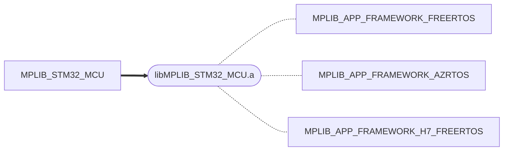
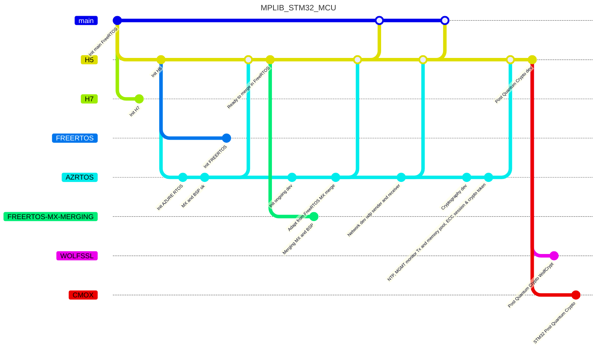
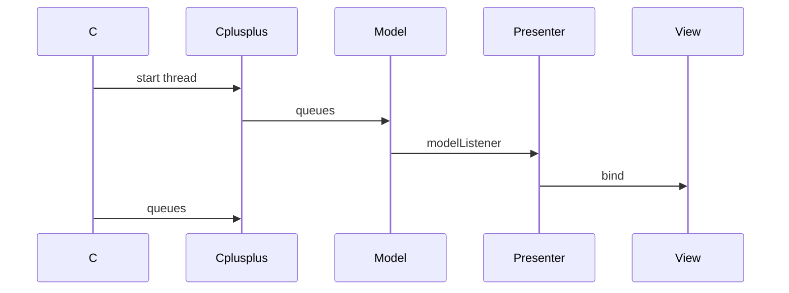
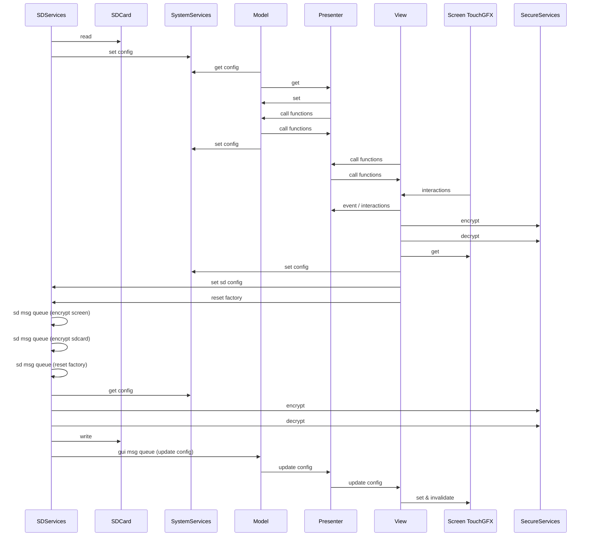

# MPLIB

**v1.0** — Embedded Systems Library for STM32 MCUs (H5, H7, N6)

Hardware encryption, ECC/PQC key exchange, TouchGFX UI, RTOS multitasking, SD card persistence, and network services.

| | |
|---|---|
| **Source code** | Private repo ([MPLIB-CODE](https://github.com/packetqc/MPLIB-CODE)) |
| **Documentation** | This repo + [GitHub Pages](https://packetqc.github.io/MPLIB/) |
| **Portfolio** | [YouTube](https://youtube.com/@packet-yi9sq?feature=shared) |

---

## Features

- **Hardware SAES encryption** — SD card data-at-rest encryption using STM32 SAES peripheral
- **Hardware AES encryption** — Data-in-transit encryption for network communications
- **ECC KEM key exchange** — Auto-announce, session initialization, key refresh — [protocol details](key-exchange.md)
- **PQC ML-KEM** — Post-quantum cryptography migration — [key sizes](pqc-sizes.md) · [LinkedIn update](https://www.linkedin.com/posts/martypacket_primer-from-quebec-city-more-details-to-activity-7373330968012562433-jv8H?utm_source=share&utm_medium=member_desktop&rcm=ACoAAD1vQloBCFsX_wTEDglktk5vKN4V8UQPqGk)
- **TouchGFX UI** — MVP-pattern frontend with daylight/night modes, log views, login screen
- **RTOS multitasking** — FreeRTOS and Azure RTOS/ThreadX via conditional compilation
- **SD card persistence** — Configuration save/load and factory reset
- **Network services** — NX Duo with UDP, NTP, management monitoring
- **UART logging** — Printf diagnostics to UART and TouchGFX log views

---

## Demo

<video autoplay mute controls src="./Images/MPLIB-demo-all-devices-screen-and-camera-hr-1-1.mp4"></video>

### Hardware Encryption

#### SD Card and Screen Encryption

| Released | Previous dev |
|----------|--------------|
|  |  |

#### Data-in-Transit Encryption

| ECC / ECIES | ECC Key Generation Auto Refresh |
|-------------|--------------------------------|
|  |  |

### Logs

### Login

### Config Save on SD Card

### Factory Reset

### Screen Modes (Daylight / Night)

---

## Hardware Targets

| MCU | Board | Role |
|-----|-------|------|
| STM32H573 (H5) | STM32H573I-DK | Primary development board |
| STM32H743 (H7) | STM32H743I-EVAL | Secondary target (FreeRTOS) |
| STM32N657 (N6) | STM32N6570-DK | Next-generation target |

- N6 setup guide: [STM32N6570-dk.md](STM32N6570-dk.md)
- N6 hardware specs: [STM32N6570-dk-specs.md](STM32N6570-dk-specs.md)

---

## Architecture

### Project Structure

| Project | Description |
|---------|-------------|
| `MPLIB_STM32_MCU` | Core library — compiles to `libMPLIB_STM32_MCU.a` |
| `MPLIB_APP_FRAMEWORK_FREERTOS` | Application framework (FreeRTOS, H5) |
| `MPLIB_APP_FRAMEWORK_AZRTOS` | Application framework (Azure RTOS, H5) |
| `MPLIB_APP_FRAMEWORK_H7_FREERTOS` | Application framework (FreeRTOS, H7) |

### Branch Strategy (Source Code)

### Threads (Singletons)

| Thread | Visual Heartbeat | Description |
|--------|-----------------|-------------|
| Default | Green LED | Entry point, resumes other threads |
| GUI | Green screen border | TouchGFX task |
| Data | Orange LED | Network data services |
| System | Red LED | System monitoring |
| Display | Blue LED | Display services |
| Secure | Red LED | Cryptographic services |
| SDCard | Blue LED | SD card persistence |
| Network | Green LED | NX Duo networking |

Resume ordering: Data → Secure → Display → SDCard → System → GUI

### Communications

#### Queues and Mutexes

| Asset | Queue | Mutex |
|-------|-------|-------|
| canLog | | x |
| gui_msg | x | |
| logs_msg | x | |
| gui_logs_msg | x | |
| logsmon_msg | x | |
| ConnectionEvent | x | |
| sd_msg | x | |

#### UI / Backend Flow

#### Application State, Interactions and Persistence

### Application Framework

*Application framework documentation to be added.*

---

## Documentation

| Document | Description |
|----------|-------------|
| [Key Exchange Protocol](key-exchange.md) | ECC KEM and PQC ML-KEM sequences, UDP/TCP payload layouts |
| [PQC Key Sizes](pqc-sizes.md) | ML-KEM and ML-DSA key size reference tables |
| [STM32N6570-DK Setup](STM32N6570-dk.md) | N6 Discovery Kit project setup and flashing guide |
| [N6 Hardware Specs](STM32N6570-dk-specs.md) | STM32N657X0H3Q MCU specifications |
| [IDE Configuration](docs/ide-config.md) | CubeIDE symbols, includes, libraries, and source exclusions |
| [RTOS Comparison](docs/rtos-comparison.md) | FreeRTOS / ThreadX API equivalence table |
| [Hardware Reference](docs/hardware-reference.md) | H5 security architecture, UID access, USB BSP, UART tips |
| [Changelog](CHANGELOG.md) | Release history |

---

## Links

- [GitHub Pages](https://packetqc.github.io/MPLIB/) — Publications and documentation site
- [Knowledge Base](https://packetqc.github.io/knowledge/) — Cross-project knowledge
- [YouTube Portfolio](https://youtube.com/@packet-yi9sq?feature=shared) — Video demos
