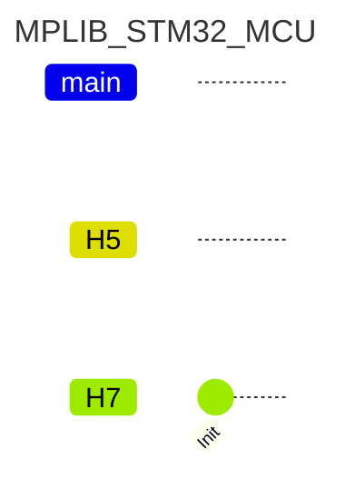
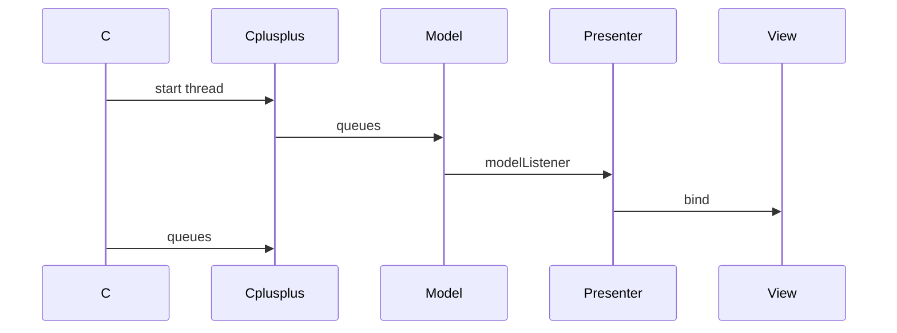
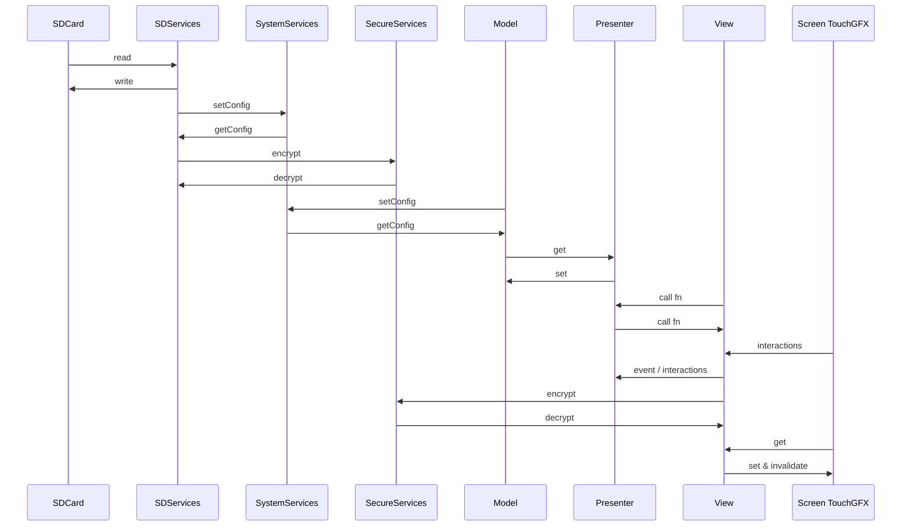

# MPLIB

MP Library stm32 and arduino

# STM32 LIB

## MPLIB STRUCTURE AND WORKFLOW

### PROJECT FOLDERS

- MPLIB_STM32_MCU
- MPLIB_APP_FRAMEWORK_AZURERTOS
- MPLIB_APP_FRAMEWORK_FREERTOS
- MPLIB_APP_FRAMEWORK_H7_FREERTOS

### CONCEPTION (compilation)

#### Summary

#### Branches

## RTOS EQUIVALENCE

| Asset                | Code | FreeRTOS             | AZRTOS (eclipse) |
| ---------------------- | ------ | ---------------------- | ------------------ |
| Thread config        |      | osThreadAttr_t       |                  |
| Thread               |      | osThreadId_t         |                  |
| Queue                |      | osMessageQueueId_t   |                  |
| Mutex                |      | osMutexId_t          |                  |
| Event / Flags config |      | osMessageQueueAttr_t |                  |
| Event / Flags        |      | osEventFlagsId_t     |                  |

## THREADS / SINGLETONS / BACKEND-SERVICES

| Threads         | Visual heartbeat    | Description |
| ----------------- | --------------------- | ------------- |
| defaultTask     | Green led           |             |
| GUI_Task        | Green screen border |             |
| DataServices    | Orange led          |             |
| SystemServiceTa | Red led             |             |
| DisplayService  | Blue led            |             |
| SecureService   | Red led             |             |
| SDService       | Blue led            |             |

## COMMUNICATIONS

### Assets

| Queues / Mutexes | col2 | col3 |
| ------------------ | ------ | ------ |
| canLog           |      |      |
| gui_msg          |      |      |
| logs_msg         |      |      |
| gui_logs_msg     |      |      |
| logsmon_msg      |      |      |
| ConnectionEvent  |      |      |
| sd_msg           |      |      |

### Programming

### Flow sequences

## APPLICATION FRAMEWORK

* [ ] TBC...

---

# PROJECTS MPLIB AND APP FRAMEWORK (IDE)

## IDE PROJECT CONFIGS (MPLIB and APP FRAMEWRORKS)

Click to view details

### MCU/MPU Settings

#### H5

#### H7

### SYMBOLS

- FREERTOS
- AZRTOS
- TOUCHGFX
- STM32H573xx
- STM32H743xx
- USE_HAL_DRIVER

### CONFIG FILES

FreeRTOSConfig.h
MPScrollList.cpp/hpp (in Core/Src and Inc temp..)

#### H5

stm32h573i_discovery_conf.h
stm32h5xx_hal_conf.h

#### H7

stm32h743i_eval_conf.h (in Core/Inc)
stm32h7xx_hal_conf.h

### Includes in code

#if defined(STM32H743xx)
#include "cmsis_os.h"
#include "stm32h743i_eval.h"
//#include "stm32h743i_eval_io.h"
#include "stm32h7xx_hal_rng.h"
#include "stm32h7xx_hal_sd.h"
#include "stm32h7xx_hal.h"
#include "stm32h743i_eval_sdram.h"
#include "stm32h743i_eval_qspi.h"
#elif defined(STM32H573xx)
#include "stm32h5xx_hal.h"
#include "stm32h573i_discovery.h"
#include "stm32h5xx_hal_rng.h"
#include "stm32h5xx_hal_cryp.h"
#endif

### INCLUDES

Core/Inc
TouchGFX/App
TouchGFX/target/generated
TouchGFX/target
Drivers/CMSIS/Include
Middlewares/Third_Party/FreeRTOS/Source/include
Middlewares/Third_Party/FreeRTOS/Source/CMSIS_RTOS_V2
Middlewares/Third_Party/CMSIS/RTOS2/Include
Middlewares/ST/touchgfx/framework/include
TouchGFX/generated/fonts/include
TouchGFX/generated/gui_generated/include
TouchGFX/generated/images/include
TouchGFX/generated/texts/include
TouchGFX/generated/videos/include
TouchGFX/gui/include

#### H5

Drivers/STM32H5xx_HAL_Driver/Inc
Drivers/STM32H5xx_HAL_Driver/Inc/Legacy
Drivers/BSP/STM32H573I-DK
Drivers/CMSIS/Device/ST/STM32H5xx/Include
Middlewares/Third_Party/FreeRTOS/Source/portable/GCC/ARM_CM33_NTZ/  non_secure/
Middlewares/ST/threadx/ports/cortex_m33/gnu/inc

#### H7

Drivers/STM32H7xx_HAL_Driver/Inc
Drivers/STM32H7xx_HAL_Driver/Inc/Legacy
Drivers/BSP/STM32H743I-EVAL
Drivers/BSP/Components/Common
Drivers/BSP/Components/exc7200
Drivers/BSP/Components/is42s32800g
Drivers/BSP/Components/mt25tl01g
Drivers/BSP/Components/ts3510
Drivers/BSP/Components/stmpe811
Drivers/CMSIS/Device/ST/STM32H7xx/Include
Middlewares/Third_Party/FreeRTOS/Source/portable/GCC/ARM_CM4F

#### MPLIB PROJECT

(as workspace)/MPLIB_STM32_MCU/Core/Inc

### LIBS (in framework app only)

#### FREERTOS

/MPLIB_APP_FRAMEWORK_FREERTOS/Core/Lib/
:libMPLIB_STM32_MCU.a

#### AZURE RTOS

/MPLIB_APP_FRAMEWORK_AZRTOS/Core/Lib/
:libMPLIB_STM32_MCU.a

### INCLUDE

1. /MPLIB_STM32_MCU/Core/Inc

   

### PROJECT REFERENCE (in paths and symbols only )

### EXCLUDE SOURCE FROM COMPILATION

#### H5

Drivers/STM32H7xx_HAL_Drier
Drivers/CMSIS/Deice/ST/STM32H7xx
...
Drivers/BSP/Components/mx25lm51245g

#### H7

Drivers/BSP/STM32H573I-DK
Drivers/BSP/STM32H743I-EVAL/stm32h743i_eval_sd.c
Drivers/STM32H5xx_HAL_Drier
Drivers/CMSIS/Deice/ST/STM32H5xx
Middlewares/ST/threadx/ports/cortex_m33
Middlewares/ST/touchgfx/framework/source
Middlewares/Third_Party/FreeRTOS/Source/portable/GCC/ARM_CM33_NTZ
Drivers/BSP/Components/mx25lm51245g

#### FREERTOS

Middlewares/ST/threadx

#### AZRTOS

...

## IDE PROJECT USAGE

Click to view details

### AZRTOS

#### app_threadx.c

/* USER CODE BEGIN PV */

TX_THREAD MPSystemThreadHandler;

/* USER CODE END PV */

//App_ThreadX_Init

/* USER CODE BEGIN App_ThreadX_Init */

/* Allocate the stack for MPSystem thread  */

if (tx_byte_allocate(byte_pool, (VOID**) &pointer,
TX_APP_STACK_SIZE, TX_NO_WAIT) != TX_SUCCESS)
{
return TX_POOL_ERROR;
}

/* Create MPSystem thread.  */

if (tx_thread_create(&MPSystemThreadHandler, "MPSystem", StartSystemServices, 0, pointer,
TX_APP_STACK_SIZE, TX_MPLIB_THREAD_PRIO, TX_MPLIB_THREAD_PREEMPTION_THRESHOLD,
TX_NO_TIME_SLICE, TX_APP_THREAD_AUTO_START) != TX_SUCCESS)
{
return TX_THREAD_ERROR;
}

/* USER CODE END App_ThreadX_Init */

### FREERTOS

#### app_freertos.c

/* USER CODE BEGIN Includes */

#include "MPSystem.h"

/* Private variables ---------------------------------------------------------*/

/* USER CODE BEGIN Variables */

/* Definitions for SystemServiceTask */

osThreadId_t SystemServiceTaskHandle;
const osThreadAttr_t SystemServiceTask_attributes = {
.name = "SystemServiceTask",
.stack_size = 1024 * 4,
.priority = (osPriority_t) osPriorityNormal,
};
/* USER CODE END Variables */

void MX_FREERTOS_Init(void) {
/* USER CODE BEGIN RTOS_THREADS */

/* add threads, ... */

SystemServiceTaskHandle = osThreadNew(StartSystemServices, NULL, &SystemServiceTask_attributes);

/* USER CODE END RTOS_THREADS */
}

## IDE PROJECT FILES

Click to view details

### PROJECT CORE FILES

### MBLIB FILES (or link to project library configurations)

### TOUCHGFX FILES

\TouchGFX\MPLIB_APP_FRAMEWORK_FREERTOS.touchgfx

It includes all the project files integrated with the MPLIB library.

- ModelListener.hpp
- Model.cpp/hpp
- Base presenter and view files for containers and for screens tgfx integration project files
- Presenter and view files for containers and for screens
- Texts
- Images

### DRIVERS

BSP
Middlewares/Third_Party/FreeRTOS/Source/portable/GCC/ARM_CM4F

### MIDDLEWARES

