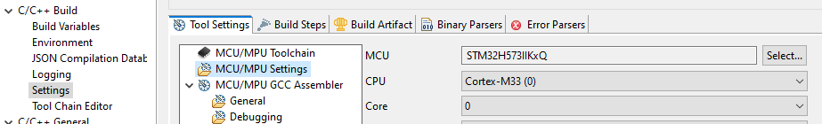
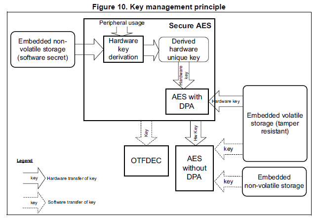

# MPLIB

# FEATURING

- HARDWARE ENCRYPTION
- LOGS
- LOGIN
- CONFIG SAVE ON SDCARD
- RESET CONFIG SAVE TO FACTORY
- SCREEN MODE DAYLIGHT OR NIGHT

<details>
<summary>Click to view video demos</summary>

## STM32 LIB

(animated gif demo is downloading...)


The embedded mp4 demo video tag is not supported in github md file but could show in any preview tool supported, mp4 videos are available in this github rep listing and(https://youtube.com/@packet-yi9sq?feature=shared) portfolio.

<video autoplay mute controls src="MPLIB-demo-all-devices-screen-and-camera-hr-1-1.mp4"></video>

(animated gif demo is downloading...)  
  

## HARDWARE ENCRYPTION

### SDCARD AND SCREEN ENCRYPTION

| Released                                                        | Previous dev                                                   |
| --------------------------------------------------------------- | -------------------------------------------------------------- |
| (animated gif demo is downloading...)                           | (animated gif demo is downloading...)                          |
|  |  |

### DATA AT REST AND ON TRANSIT ENCRYPTION

(dev in progress...)

## LOGS

(animated gif demo is downloading...)  
  

## LOGIN

(animated gif demo is downloading...)  
  

## CONFIG SAVE ON SDCARD

(animated gif demo is downloading...)


## RESET CONFIG SAVE TO FACTORY

(animated gif demo is downloading...)  
  

## SCREEN MODE DAYLIGHT OR NIGHT

(animated gif demo is downloading...)  
  

</details>

# THE PROJECT

## MPLIB STRUCTURE AND WORKFLOW

### PROJECT FOLDERS

- MPLIB_STM32_MCU
- MPLIB_APP_FRAMEWORK_AZURERTOS
- MPLIB_APP_FRAMEWORK_FREERTOS
- MPLIB_APP_FRAMEWORK_H7_FREERTOS

### CONCEPTION (compilation)

#### Summary


#### Branches


## RTOS EQUIVALENCE


| Asset                | Code | FreeRTOS             | AZRTOS (eclipse)      |
| -------------------- | ---- | -------------------- | --------------------- |
| Thread config        |      | osThreadAttr_t       | NA                    |
| Thread               |      | osThreadId_t         | TX_THREAD             |
| Queue                |      | osMessageQueueId_t   | TX_QUEUE              |
| Mutex                |      | osMutexId_t          | TX_MUTEX              |
| Event / Flags config |      | osMessageQueueAttr_t | (tbc)                 |
| Event / Flags        |      | osEventFlagsId_t     | (tbc)                 |
| Heap stats           |      | vPortGetHeapStats    | TX_BYTE_POOL          |
| Memory allocation    |      | pvPortMalloc         | tx_byte_allocate      |
| Memory free          |      | vPortFree            | tx_byte_release       |
| Memory pool          |      | NA                   | tx_byte_pool_create   |
| Thread sleep         |      | osThreadSuspend      | tx_thread_suspend     |
| Thread resume        |      | osThreadResume       | tx_thread_resume      |
| Delay                |      | HAL_Delay            | tx_thread_sleep (/10) |

### FROM EXTERNAL SITE

<details>
<summary>Click to view details</summary>  

https://wiki.st.com/stm32mcu/wiki/Introduction_to_THREADX  


</details>

## THREADS / SINGLETONS / BACKEND-SERVICES


| Threads | Visual heartbeat    | Description |
| ------- | ------------------- | ----------- |
| default | Green led           |             |
| GUI     | Green screen border |             |
| Data    | Orange led          |             |
| System  | Red led             |             |
| Display | Blue led            |             |
| Secure  | Red led             |             |
| SDCard  | Blue led            |             |
| Network | Green led ||

## COMMUNICATIONS

### Assets


| Assets          | Queues | Mutexes |
| --------------- | ------ | ------- |
| canLog          |        | x       |
| gui_msg         | x      |         |
| logs_msg        | x      |         |
| gui_logs_msg    | x      |         |
| logsmon_msg     | x      |         |
| ConnectionEvent | x      |         |
| sd_msg          | x      |         |

### Programming


### Flow sequences

#### Application state, interactions and persistence


## APPLICATION FRAMEWORK

* [ ] TBC...

---

# PROJECTS MPLIB AND APP FRAMEWORK (IDE)

## IDE PROJECT CONFIGS (MPLIB and APP FRAMEWRORKS)

<details>
<summary>Click to view details</summary>

### MX CODE GENERATION (THREADX COMPILATION)

TBC. Notes and details on CubeMX configuration to support BSP modules. Ex: sdcard, activate, no code generation, no init and no visibility (see in advanced project code generation)

### MCU/MPU Settings

#### H5



#### H7


### SYMBOLS

- TOUCHGFX
- STM32H573xx
- STM32H743xx
- USE_HAL_DRIVER

#### FREERTOS

- FREERTOS

#### AZURE RTOS

- AZRTOS
- TX_INCLUDE_USER_DEFINE_FILE
- TX_SINGLE_MODE_NON_SECURE
- NX_INCLUDE_USER_DEFINE_FILE
- NX_SECURE_INCLUDE_USER_DEFINE_FILE

### CONFIG FILES

#### FREERTOS

FreeRTOSConfig.h

#### AZURE RTOS

...

#### H5

stm32h573i_discovery_conf.h
stm32h5xx_hal_conf.h

#### H7

stm32h743i_eval_conf.h (in Core/Inc)
stm32h7xx_hal_conf.h

### Includes in code

#define TX_APP_THREAD_TIME_SLICE                1 //TX_NO_TIME_SLICE

#### HW defined

#if defined(STM32H743xx)

#include "cmsis_os.h"
#include "stm32h743i_eval.h"
//#include "stm32h743i_eval_io.h"
#include "stm32h7xx_hal_rng.h"
#include "stm32h7xx_hal_sd.h"
#include "stm32h7xx_hal.h"
#include "stm32h743i_eval_sdram.h"
#include "stm32h743i_eval_qspi.h"

#elif defined(STM32H573xx)

#include "stm32h5xx_hal.h"
#include "stm32h5xx_hal_eth.h"
#include "stm32h573i_discovery.h"
#include "stm32h5xx_hal_rng.h"
#include "stm32h5xx_hal_cryp.h"

#endif

#### RTOS defined

#if defined(FREERTOS)

#elif defined(AZRTOS)

#include <malloc.h>
#include "tx_api.h"

#endif

### INCLUDES

(workspace_path)/MPLIB_STM32_MCU/Core/Inc
Core/Inc
TouchGFX/App
TouchGFX/target/generated
TouchGFX/target
Drivers/CMSIS/Include
Middlewares/ST/touchgfx/framework/include
TouchGFX/generated/fonts/include
TouchGFX/generated/gui_generated/include
TouchGFX/generated/images/include
TouchGFX/generated/texts/include
TouchGFX/generated/videos/include
TouchGFX/gui/include

#### H5

Drivers/STM32H5xx_HAL_Driver/Inc
Drivers/STM32H5xx_HAL_Driver/Inc/Legacy
Drivers/BSP/STM32H573I-DK
Drivers/CMSIS/Device/ST/STM32H5xx/Include

##### AZURE RTOS (Eclipse THREADX)

Middlewares/ST/threadx/ports/cortex_m33/gnu/inc
Middlewares/ST/threadx/common/inc

##### FREERTOS

Middlewares/Third_Party/FreeRTOS/Source/portable/GCC/ARM_CM33_NTZ/non_secure/
Middlewares/Third_Party/FreeRTOS/Source/include
Middlewares/Third_Party/FreeRTOS/Source/CMSIS_RTOS_V2
Middlewares/Third_Party/CMSIS/RTOS2/Include

#### H7

Drivers/STM32H7xx_HAL_Driver/Inc
Drivers/STM32H7xx_HAL_Driver/Inc/Legacy
Drivers/BSP/STM32H743I-EVAL
Drivers/BSP/Components/Common
Drivers/BSP/Components/exc7200
Drivers/BSP/Components/is42s32800g
Drivers/BSP/Components/mt25tl01g
Drivers/BSP/Components/ts3510
Drivers/BSP/Components/stmpe811
Drivers/CMSIS/Device/ST/STM32H7xx/Include
Middlewares/Third_Party/FreeRTOS/Source/portable/GCC/ARM_CM4F

#### MPLIB PROJECT

(as workspace)/MPLIB_STM32_MCU/Core/Inc

### LIBS (in framework app only)

#### FREERTOS

/MPLIB_APP_FRAMEWORK_FREERTOS/Core/Lib/
:libMPLIB_STM32_MCU.a

#### AZURE RTOS

/MPLIB_APP_FRAMEWORK_AZRTOS/Core/Lib/
:libMPLIB_STM32_MCU.a

### INCLUDE

1. /MPLIB_STM32_MCU/Core/Inc

   

### PROJECT REFERENCE (in paths and symbols only )

### EXCLUDE SOURCE FROM COMPILATION

#### H5

Drivers/STM32H7xx_HAL_Driver
Drivers/CMSIS/Device/ST/STM32H7xx
...
Drivers/BSP/Components/mx25lm51245g

#### H7

Drivers/BSP/STM32H573I-DK
Drivers/BSP/STM32H743I-EVAL/stm32h743i_eval_sd.c
Drivers/STM32H5xx_HAL_Drier
Drivers/CMSIS/Device/ST/STM32H5xx
Middlewares/ST/threadx/ports/cortex_m33
Middlewares/ST/touchgfx/framework/source
Middlewares/Third_Party/FreeRTOS/Source/portable/GCC/ARM_CM33_NTZ
Drivers/BSP/Components/mx25lm51245g

#### FREERTOS

Middlewares/ST/threadx

#### AZRTOS

...

</details>

## IDE PROJECT USAGE

<details>
<summary>Click to view details</summary>

### AZRTOS

#### app_azure_rtos_config.h

/* Exported constants --------------------------------------------------------*/
/* Using static memory allocation via threadX Byte memory pools */

#define USE_STATIC_ALLOCATION                    1

#define TX_APP_MEM_POOL_SIZE                     1024*10

#define TOUCHGFX_APP_MEM_POOL_SIZE               8192

/* USER CODE BEGIN EC */

#define TX_MEM_DEFAULT_THREAD	256
#define TX_MEM_DATA_THREAD		1024
#define TX_MEM_SYSTEM_THREAD	256
#define TX_MEM_DISPLAY_THREAD	256
#define TX_MEM_SECURE_THREAD	256
#define TX_MEM_SDCARD_THREAD	512

/* USER CODE END EC */

#### app_threadx.c

/* USER CODE BEGIN PV */

TX_THREAD defaultTaskHandle;
TX_THREAD GUI_TaskHandle;
TX_THREAD DataServicesHandle;
TX_THREAD SystemServiceTaHandle;
TX_THREAD DisplayServiceHandle;
TX_THREAD SecureServiceHandle;
TX_THREAD SDServiceHandle;

/* USER CODE END PV */

/* USER CODE BEGIN PFP */
//extern void TouchGFX_Task(ULONG thread_input);
extern void StartDataServices(ULONG thread_input);
extern void StartSystemServices(ULONG thread_input);
extern void StartDisplayServices(ULONG thread_input);
extern void StartSecureServices(ULONG thread_input);
extern void StartSDServices(ULONG thread_input);
/* USER CODE END PFP */

//App_ThreadX_Init

/* USER CODE BEGIN App_ThreadX_MEM_POOL */
TX_BYTE_POOL *byte_pool = (TX_BYTE_POOL*)memory_ptr;
/* USER CODE END App_ThreadX_MEM_POOL */

/* USER CODE BEGIN App_ThreadX_Init */

CHAR *pointer;

if (tx_byte_allocate(byte_pool, (VOID**) &pointer, TX_APP_STACK_SIZE, TX_NO_WAIT) != TX_SUCCESS)
{
return TX_POOL_ERROR;
}

/* Create default start thread.  */
if (tx_thread_create(&defaultTaskHandle, "Default start thread", StartDefaultTask, 0, pointer,
TX_APP_STACK_SIZE, TX_MPLIB_THREAD_PRIO, TX_MPLIB_THREAD_PREEMPTION_THRESHOLD,
TX_NO_TIME_SLICE, TX_APP_THREAD_AUTO_START) != TX_SUCCESS)
{
return TX_THREAD_ERROR;
}

/* Create all threads here */
// ...

//  tx_thread_suspend(GUI_TaskHandle);
//  tx_thread_suspend(DataServicesHandle);
//  tx_thread_suspend(SystemServiceTaHandle);
//  tx_thread_suspend(DisplayServiceHandle);
//  tx_thread_suspend(SecureServiceHandle);
//  tx_thread_suspend(SDServiceHandle);

/* USER CODE END App_ThreadX_Init */

/* USER CODE BEGIN 1 */
void StartDefaultTask(ULONG thread_input)
{
/* USER CODE BEGIN tx_thread_entry */
tx_thread_resume(DataServicesHandle);

tx_thread_resume(SecureServiceHandle);

tx_thread_sleep(30);

tx_thread_resume(DisplayServiceHandle);

tx_thread_sleep(30);

tx_thread_resume(SDServiceHandle);

tx_thread_resume(SystemServiceTaHandle);

tx_thread_resume(GUI_TaskHandle);

while(1) {
tx_thread_sleep(30);
//		printf("THREADX\n");
//		tx_thread_sleep(100);
//		BSP_LED_Off(LED1);
//		tx_thread_sleep(100);
//		BSP_LED_On(LED1);
}
/* USER CODE END tx_thread_entry */
}
/* USER CODE END 1 */

### FREERTOS

#### app_freertos.c

/* USER CODE BEGIN Includes */

#include "MPSystem.h"

/* Private variables ---------------------------------------------------------*/

/* USER CODE BEGIN Variables */

/* Definitions for SystemServiceTask */

osThreadId_t SystemServiceTaskHandle;
const osThreadAttr_t SystemServiceTask_attributes = {
.name = "SystemServiceTask",
.stack_size = 1024 * 4,
.priority = (osPriority_t) osPriorityNormal,
};
/* USER CODE END Variables */

void MX_FREERTOS_Init(void) {
/* USER CODE BEGIN RTOS_THREADS */

/* add threads, ... */

SystemServiceTaskHandle = osThreadNew(StartSystemServices, NULL, &SystemServiceTask_attributes);

/* USER CODE END RTOS_THREADS */
}

</details>

## IDE PROJECT FILES

<details>
<summary>Click to view details</summary>

### PROJECT CORE FILES

### MBLIB FILES (or link to project library configurations)

### TOUCHGFX FILES

\TouchGFX\MPLIB_APP_FRAMEWORK_FREERTOS.touchgfx

It includes all the project files integrated with the MPLIB library.

- ModelListener.hpp
- Model.cpp/hpp
- Base presenter and view files for containers and for screens tgfx integration project files
- Presenter and view files for containers and for screens
- Texts
- Images

### DRIVERS

BSP
Middlewares/Third_Party/FreeRTOS/Source/portable/GCC/ARM_CM4F

### MIDDLEWARES

</details>


# Programmatically clear serial uart terminal screen

<details>
<summary>Click to view details</summary>


```
printf( "\x1B[2J" );
printf("%c[0;0H", 0x1b);
```
</details>

# SECURITY ARCHITECTURE OF STM32H5

In reference of ST documentation RM0481.pdf, 

<details>  
<summary>Click to view details</summary>  




  

  

# CRYPTOGRAPHIC LIBRARY MIDDLEWARE


</details>

# TO READ UID MEMORY (MPU CONFIG example)

<details>  
<summary>Click to view details</summary>  

```
  MPU_InitStruct.Number = MPU_REGION_NUMBER1;
  MPU_InitStruct.BaseAddress = 0x08FFF800;
  MPU_InitStruct.LimitAddress = 0x08FFFFFF;
  MPU_InitStruct.AccessPermission = MPU_REGION_ALL_RO;
```

</details>
