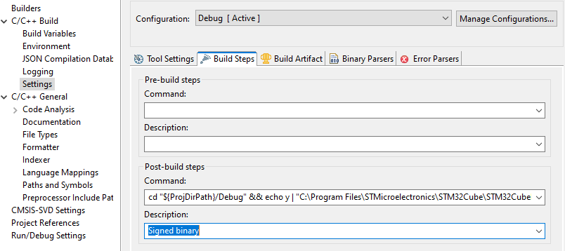

# STM32N6570-dk

# Table Of Content

- preface
- create a tgfx project with the STM32N6570-dk
- prepare the cubeide project configuration
- write fsbl and app binaries (.bin) and assets (...assets.hex) to the device
- references
- about the author of the documentation page
- copy the application .cproject file to the root of the project parent folder before code generation from TouchGFX after this convertion
- replace the application .cproject with this new .cproject updated after code generation from TouchGFX

# Preface

due to actual complexity, or interoperability to complete with this secured device, creating project from the cubemx is for now impossible.

The options are:
- to customize a newly project from TouchGFX designer.
- or, if you want a projects names not the device equipement name that comes with tgfx designer project, create a new project in cubeide from an ioc of the TouchGFX Designer created project.

In both scenario, to have working binaries, you will have to make sure code is regenerated from CubeMX after having Designing and Generating from TouchGFX.


** NOTE: ** 

Please note that this convertion procedure does not yet work, parts of this documentation is applicable upon creating a project in cubeide from a tgfx designer project ioc file.

When you create a project in cubeide from tgfx ioc file, it will be restructured under root which usually come wich the default mx code generation but touchgfx have a different project folder structure...

If you have created a project from an ioc file of a TouchGFX Designer created project, these steps still applies:

- change back the application linker file (lost in regeneration!)
- change back the fsbl linker file (lost in regeneration!)
- make sure code is regenerated in cubemx after designed and generated in touchgfx
- write fsbl and app binaries (.bin) and assets (...assets.hex) to the device

# Create a TouchGFX project with the STM32N6570-dk

- create project from tgfx
- open cubemx and regenerate code under root
- add BSP library in Drivers folder
- exclude simulator folders from project build, in touchgfx and touchgfx/generated
- exclude middlewares/st/touchgfz/os folder from build
- exclude middlewares/st/touchgfz/framework/include/platform/hal/simulator folder from build
- exclude middlewares/st/touchgfz/framework/source/platform/driver/touch folder from sub project application (SDL2TouchController.cpp)
- delete middlewares/st/touchgfz/framework/source/platform/hal/simulator folder from sub project application
- adapt include paths in the cubeide project
  - refer to the next details in this section for includes to review or to import from an xml file
  - change entry hardcoded on the project root name to your project. Ex: STM32N6570-DK
- change back the application linker file (lost in regeneration!)
- change back the fsbl linker file (lost in regeneration!)

<details>
  <summary>Click to see details of application linker file</summary>

```
/*
******************************************************************************
**
** @file        : LinkerScript.ld
**
** @author      : Auto-generated by STM32CubeIDE
**
** @brief       : Linker script for STM32N6XX Device from STM32N6 series
**                      2048 KBytes RAM
**
**                Set heap size, stack size and stack location according
**                to application requirements.
**
**                Set memory bank area and size if external memory is used
**
**  Target      : STMicroelectronics STM32
**
**  Distribution: The file is distributed as is, without any warranty
**                of any kind.
**
******************************************************************************
** @attention
**
** Copyright (c) 2024 STMicroelectronics.
** All rights reserved.
**
** This software is licensed under terms that can be found in the LICENSE file
** in the root directory of this software component.
** If no LICENSE file comes with this software, it is provided AS-IS.
**
******************************************************************************
*/

/* Entry Point */
ENTRY(Reset_Handler)
_Min_Heap_Size = 0x1000; /* required amount of heap */
_Min_Stack_Size = 0x1000; /* required amount of stack */

/* Highest address of the user mode stack */
_estack = ORIGIN(RAM) + LENGTH(RAM); /* end of "RAM" Ram type memory */
_sstack = _estack - _Min_Stack_Size;


/* Memories definition */
MEMORY
{
  DTCM_RAM       (xrw)    : ORIGIN = 0x30000000,   LENGTH = 0x00020000
  LRUN_APPLI_RAM (xr)     : ORIGIN = 0x34000400,   LENGTH = 0x000FFC00
  RAM            (xrw)    : ORIGIN = 0x34100000,   LENGTH = 0x00040000
  CMDLIST_RAM    (xrw)    : ORIGIN = 0x34140000,   LENGTH = 0x00006000
  FB_RAM         (xrw)    : ORIGIN = 0x34146000,   LENGTH = 0x002DA000
  PSRAM          (rw)     : ORIGIN = 0x90000000,   LENGTH = 0x02000000
  ROM            (xr)     : ORIGIN = 0x70100400,   LENGTH = 0x000FFC00
  ASSETS_ROM     (r)      : ORIGIN = 0x70200000,   LENGTH = 0x07E00000
}

/* Sections */
SECTIONS
{
  /* The startup code into "RAM" Ram type memory */
  .isr_vector :
  {
    . = ALIGN(4);
    KEEP(*(.isr_vector)) /* Startup code */
    . = ALIGN(4);
  } >LRUN_APPLI_RAM

  /* The program code and other data into "RAM" Ram type memory */
  .text :
  {
    . = ALIGN(4);
    *(.text)           /* .text sections (code) */
    *(.text*)          /* .text* sections (code) */
    *(.glue_7)         /* glue arm to thumb code */
    *(.glue_7t)        /* glue thumb to arm code */
    *(.eh_frame)
    *(.RamFunc)        /* .RamFunc sections */
    *(.RamFunc*)       /* .RamFunc* sections */

    KEEP (*(.init))
    KEEP (*(.fini))

    . = ALIGN(4);
    _etext = .;        /* define a global symbols at end of code */
  } >LRUN_APPLI_RAM

  /* Constant data into "RAM" Ram type memory */
  .rodata :
  {
    . = ALIGN(4);
    *(.rodata)         /* .rodata sections (constants, strings, etc.) */
    *(.rodata*)        /* .rodata* sections (constants, strings, etc.) */
    . = ALIGN(4);
  } >LRUN_APPLI_RAM

  .ARM.extab   (READONLY) : /* The READONLY keyword is only supported in GCC11 and later, remove it if using GCC10 or earlier. */
   {
     . = ALIGN(4);
    *(.ARM.extab* .gnu.linkonce.armextab.*)
    . = ALIGN(4);
  } >LRUN_APPLI_RAM

  .ARM (READONLY) : /* The READONLY keyword is only supported in GCC11 and later, remove it if using GCC10 or earlier. */
   {
     . = ALIGN(4);
    __exidx_start = .;
    *(.ARM.exidx*)
    __exidx_end = .;
    . = ALIGN(4);
  } >LRUN_APPLI_RAM

  .preinit_array     (READONLY) : /* The READONLY keyword is only supported in GCC11 and later, remove it if using GCC10 or earlier. */
  {
    . = ALIGN(4);
    PROVIDE_HIDDEN (__preinit_array_start = .);
    KEEP (*(.preinit_array*))
    PROVIDE_HIDDEN (__preinit_array_end = .);
    . = ALIGN(4);
  } >LRUN_APPLI_RAM

  .init_array (READONLY) : /* The READONLY keyword is only supported in GCC11 and later, remove it if using GCC10 or earlier. */
  {
    . = ALIGN(4);
    PROVIDE_HIDDEN (__init_array_start = .);
    KEEP (*(SORT(.init_array.*)))
    KEEP (*(.init_array*))
    PROVIDE_HIDDEN (__init_array_end = .);
    . = ALIGN(4);
  } >LRUN_APPLI_RAM

  .fini_array (READONLY) : /* The READONLY keyword is only supported in GCC11 and later, remove it if using GCC10 or earlier. */
  {
    . = ALIGN(4);
    PROVIDE_HIDDEN (__fini_array_start = .);
    KEEP (*(SORT(.fini_array.*)))
    KEEP (*(.fini_array*))
    PROVIDE_HIDDEN (__fini_array_end = .);
    . = ALIGN(4);
  } >LRUN_APPLI_RAM

  /* Used by the startup to initialize data */
  _sidata = LOADADDR(.data);

  /* Initialized data sections into "RAM" Ram type memory */
  .data :
  {
    . = ALIGN(4);
    _sdata = .;        /* create a global symbol at data start */
    *(.data)           /* .data sections */
    *(.data*)          /* .data* sections */

    . = ALIGN(4);
    _edata = .;        /* define a global symbol at data end */

  } >RAM AT> LRUN_APPLI_RAM

  .noncacheable :
  {
    . = ALIGN(8);
    __snoncacheable = .;/* create symbol for start of section */
    KEEP(*(.noncacheable))
    . = ALIGN(8);
    __enoncacheable = .;  /* create symbol for end of section */
  } > RAM

  .gnu.sgstubs :
  {
    . = ALIGN(4);
    *(.gnu.sgstubs*)   /* Secure Gateway stubs */
    . = ALIGN(4);
  } >LRUN_APPLI_RAM

  /* Uninitialized data section into "RAM" Ram type memory */
  . = ALIGN(4);
  .bss :
  {
    /* This is used by the startup in order to initialize the .bss section */
    _sbss = .;         /* define a global symbol at bss start */
    __bss_start__ = _sbss;
    *(.bss)
    *(.bss*)
    *(COMMON)

    . = ALIGN(4);
    _ebss = .;         /* define a global symbol at bss end */
    __bss_end__ = _ebss;
  } >RAM

  /* User_heap_stack section, used to check that there is enough "RAM" Ram  type memory left */
  ._user_heap_stack :
  {
    . = ALIGN(8);
    PROVIDE ( end = . );
    PROVIDE ( _end = . );
    . = . + _Min_Heap_Size;
    . = . + _Min_Stack_Size;
    . = ALIGN(8);
  } >RAM

  /* Remove information from the compiler libraries */
  /DISCARD/ :
  {
    libc.a ( * )
    libm.a ( * )
    libgcc.a ( * )
  }

  .ARM.attributes 0 : { *(.ARM.attributes) }

  BufferSection (NOLOAD) :
  {
    *(TouchGFX_Framebuffer TouchGFX_Framebuffer.*)
    *(.gnu.linkonce.r.*)
    . = ALIGN(0x8);

    *(Nemagfx_Stencil_Buffer Nemagfx_Stencil_Buffer.*)
    *(.gnu.linkonce.r.*)
    . = ALIGN(0x8);
  } >FB_RAM
  
  UncachedSection (NOLOAD) :
  {
    *(Nemagfx_Memory_Pool_Buffer Nemagfx_Memory_Pool_Buffer.*)
    *(.gnu.linkonce.r.*)
    . = ALIGN(0x8);
  } >CMDLIST_RAM
  
  FontFlashSection :
  {
    *(FontFlashSection FontFlashSection.*)
    *(.gnu.linkonce.r.*)
    . = ALIGN(0x4);
  } >ASSETS_ROM

  TextFlashSection :
  {
    *(TextFlashSection TextFlashSection.*)
    *(.gnu.linkonce.r.*)
    . = ALIGN(0x4);
  } >ASSETS_ROM

  ExtFlashSection :
  {
    *(ExtFlashSection ExtFlashSection.*)
    *(.gnu.linkonce.r.*)
    . = ALIGN(0x4);
  } >ASSETS_ROM
}
```
</details>

<details>
  <summary>Click to see details of first stage boot loader (fsbl) linker file</summary>

```
/*
******************************************************************************
**
** @file        : STM32N6XX_AXISRAM2_fsbl.ld
**
** @author      : GPM Application Team
**
** @brief       : Linker script for STM32N6XX Device from STM32N6 series
**                      512 KBytes RAM
**
**                Set heap size, stack size and stack location according
**                to application requirements.
**
**                Set memory bank area and size if external memory is used
**
**  Target      : STMicroelectronics STM32
**
**  Distribution: The file is distributed as is, without any warranty
**                of any kind.
**
******************************************************************************
** @attention
**
** Copyright (c) 2024 STMicroelectronics.
** All rights reserved.
**
** This software is licensed under terms that can be found in the LICENSE file
** in the root directory of this software component.
** If no LICENSE file comes with this software, it is provided AS-IS.
**
******************************************************************************
*/

/* Entry Point */
ENTRY(Reset_Handler)

/* Highest address of the user mode stack */
_estack = ORIGIN(RAM) + LENGTH(RAM); /* end of "RAM" Ram type memory */
_sstack = _estack - _Min_Stack_Size;

_Min_Heap_Size = 0x200; /* required amount of heap */
_Min_Stack_Size = 0x800; /* required amount of stack */

/* Memories definition */
MEMORY
{
  ROM    		(xrw)    : ORIGIN = 0x34180400,   LENGTH = 255K
  RAM    		(xrw)    : ORIGIN = 0x341C0000,   LENGTH = 256K
  APPLI_ROM		(xr)     : ORIGIN = 0x70100400,   LENGTH = 0x000FFC00
  ASSETS_ROM	(r)      : ORIGIN = 0x70200000,   LENGTH = 0x07E00000
}

/* Sections */
SECTIONS
{
  /* The startup code into "RAM" Ram type memory */
  .isr_vector :
  {
    . = ALIGN(4);
    KEEP(*(.isr_vector)) /* Startup code */
    . = ALIGN(4);
  } >ROM

  /* The program code and other data into "RAM" Ram type memory */
  .text :
  {
    . = ALIGN(4);
    *(.text)           /* .text sections (code) */
    *(.text*)          /* .text* sections (code) */
    *(.glue_7)         /* glue arm to thumb code */
    *(.glue_7t)        /* glue thumb to arm code */
    *(.eh_frame)
    *(.RamFunc)        /* .RamFunc sections */
    *(.RamFunc*)       /* .RamFunc* sections */

    KEEP (*(.init))
    KEEP (*(.fini))

    . = ALIGN(4);
    _etext = .;        /* define a global symbols at end of code */
  } >ROM

  /* Constant data into "RAM" Ram type memory */
  .rodata :
  {
    . = ALIGN(4);
    *(.rodata)         /* .rodata sections (constants, strings, etc.) */
    *(.rodata*)        /* .rodata* sections (constants, strings, etc.) */
    . = ALIGN(4);
  } >ROM

  .ARM.extab   (READONLY) : /* The READONLY keyword is only supported in GCC11 and later, remove it if using GCC10 or earlier. */
   {
    . = ALIGN(4);
    *(.ARM.extab* .gnu.linkonce.armextab.*)
    . = ALIGN(4);
  } >ROM

  .ARM (READONLY) : /* The READONLY keyword is only supported in GCC11 and later, remove it if using GCC10 or earlier. */
   {
    . = ALIGN(4);
    __exidx_start = .;
    *(.ARM.exidx*)
    __exidx_end = .;
    . = ALIGN(4);
  } >ROM

  .preinit_array     (READONLY) : /* The READONLY keyword is only supported in GCC11 and later, remove it if using GCC10 or earlier. */
  {
    . = ALIGN(4);
    PROVIDE_HIDDEN (__preinit_array_start = .);
    KEEP (*(.preinit_array*))
    PROVIDE_HIDDEN (__preinit_array_end = .);
    . = ALIGN(4);
  } >ROM

  .init_array (READONLY) : /* The READONLY keyword is only supported in GCC11 and later, remove it if using GCC10 or earlier. */
  {
    . = ALIGN(4);
    PROVIDE_HIDDEN (__init_array_start = .);
    KEEP (*(SORT(.init_array.*)))
    KEEP (*(.init_array*))
    PROVIDE_HIDDEN (__init_array_end = .);
    . = ALIGN(4);
  } >ROM

  .fini_array (READONLY) : /* The READONLY keyword is only supported in GCC11 and later, remove it if using GCC10 or earlier. */
  {
    . = ALIGN(4);
    PROVIDE_HIDDEN (__fini_array_start = .);
    KEEP (*(SORT(.fini_array.*)))
    KEEP (*(.fini_array*))
    PROVIDE_HIDDEN (__fini_array_end = .);
    . = ALIGN(4);
  } >ROM

  /* Used by the startup to initialize data */
  _sidata = LOADADDR(.data);

  /* Initialized data sections into "RAM" Ram type memory */
  .data :
  {
    . = ALIGN(4);
    _sdata = .;        /* create a global symbol at data start */
    *(.data)           /* .data sections */
    *(.data*)          /* .data* sections */

    . = ALIGN(4);
    _edata = .;        /* define a global symbol at data end */

  } >RAM AT> ROM

  .noncacheable :
  {
    . = ALIGN(8);
    __snoncacheable = .;/* create symbol for start of section */
    KEEP(*(.noncacheable))
    . = ALIGN(8);
    __enoncacheable = .;  /* create symbol for end of section */
  } > RAM


  .gnu.sgstubs :
  {
    . = ALIGN(4);
    *(.gnu.sgstubs*)   /* Secure Gateway stubs */
    . = ALIGN(4);
  } >ROM
  /* Uninitialized data section into "RAM" Ram type memory */
  . = ALIGN(4);
  .bss :
  {
    /* This is used by the startup in order to initialize the .bss section */
    _sbss = .;         /* define a global symbol at bss start */
    __bss_start__ = _sbss;
    *(.bss)
    *(.bss*)
    *(COMMON)

    . = ALIGN(4);
    _ebss = .;         /* define a global symbol at bss end */
    __bss_end__ = _ebss;
  } >RAM

  /* User_heap_stack section, used to check that there is enough "RAM" Ram  type memory left */
  ._user_heap_stack :
  {
    . = ALIGN(8);
    PROVIDE ( end = . );
    PROVIDE ( _end = . );
    . = . + _Min_Heap_Size;
    . = . + _Min_Stack_Size;
    . = ALIGN(8);
  } >RAM

  /* Remove information from the compiler libraries */
  /DISCARD/ :
  {
    libc.a ( * )
    libm.a ( * )
    libgcc.a ( * )
  }

  .ARM.attributes 0 : { *(.ARM.attributes) }
}
```
</details>

# Prepare the cubeide project configuration

See reference getting started for details.

## Adapt include paths in the cubeide project

In the application sub project, include the following include paths:


<details>
  <summary>Click here to see details of the xml file to import or the includes to review</summary>

```
<?xml version="1.0" encoding="UTF-8"?>
<cdtprojectproperties>
  <section name="org.eclipse.cdt.internal.ui.wizards.settingswizards.IncludePaths">
    <language id="org.eclipse.cdt.core.assembly" name="s,S">
      <includepath workspace_path="true">/${ProjName}/Middlewares/ST/touchgfx/framework/include</includepath>
      <includepath workspace_path="true">/${ProjName}/Middlewares/ST/touchgfx_components/gpu2d/NemaGFX/include</includepath>
      <includepath workspace_path="true">/${ProjName}/Middlewares/ST/touchgfx_components/gpu2d/TouchGFXNema/include</includepath>
      <includepath workspace_path="true">/${ProjName}/TouchGFX/generated/fonts/include</includepath>
      <includepath workspace_path="true">/${ProjName}/TouchGFX/generated/gui_generated/include</includepath>
      <includepath workspace_path="true">/${ProjName}/TouchGFX/generated/images/include</includepath>
      <includepath workspace_path="true">/${ProjName}/TouchGFX/generated/texts/include</includepath>
      <includepath workspace_path="true">/${ProjName}/TouchGFX/generated/videos/include</includepath>
      <includepath workspace_path="true">/${ProjName}/TouchGFX/gui/include</includepath>
      <includepath workspace_path="true">/${ProjName}/Core/Inc</includepath>
      <includepath workspace_path="true">/${ProjName}/TouchGFX/target/generated</includepath>
      <includepath workspace_path="true">/${ProjName}/TouchGFX/target</includepath>
      <includepath workspace_path="true">/STM32N6570-DK/Drivers/STM32N6xx_HAL_Driver/Inc</includepath>
      <includepath workspace_path="true">/STM32N6570-DK/Drivers/CMSIS/Device/ST/STM32N6xx/Include</includepath>
      <includepath workspace_path="true">/STM32N6570-DK/Drivers/CMSIS/Include</includepath>
      <includepath workspace_path="true">/STM32N6570-DK/Middlewares/ST/threadx/ports/cortex_M55/gnu/inc</includepath>
      <includepath workspace_path="true">/STM32N6570-DK/Middlewares/ST/threadx/common/inc</includepath>
      <includepath workspace_path="true">/STM32N6570-DK/Middlewares/ST/STM32_ExtMem_Manager</includepath>
      <includepath workspace_path="true">/${ProjName}/AZURE_RTOS/App</includepath>
      <includepath workspace_path="true">/${ProjName}/TouchGFX/App</includepath>
      <includepath workspace_path="true">/STM32N6570-DK/Secure_nsclib</includepath>
    </language>
    <language id="org.eclipse.cdt.core.gcc" name="C Source File">
      <includepath workspace_path="true">/${ProjName}/Middlewares/ST/touchgfx/framework/include</includepath>
      <includepath workspace_path="true">/${ProjName}/Middlewares/ST/touchgfx_components/gpu2d/NemaGFX/include</includepath>
      <includepath workspace_path="true">/${ProjName}/Middlewares/ST/touchgfx_components/gpu2d/TouchGFXNema/include</includepath>
      <includepath workspace_path="true">/${ProjName}/TouchGFX/generated/fonts/include</includepath>
      <includepath workspace_path="true">/${ProjName}/TouchGFX/generated/gui_generated/include</includepath>
      <includepath workspace_path="true">/${ProjName}/TouchGFX/generated/images/include</includepath>
      <includepath workspace_path="true">/${ProjName}/TouchGFX/generated/texts/include</includepath>
      <includepath workspace_path="true">/${ProjName}/TouchGFX/generated/videos/include</includepath>
      <includepath workspace_path="true">/${ProjName}/TouchGFX/gui/include</includepath>
      <includepath workspace_path="true">/${ProjName}/Core/Inc</includepath>
      <includepath workspace_path="true">/${ProjName}/TouchGFX/target/generated</includepath>
      <includepath workspace_path="true">/${ProjName}/TouchGFX/target</includepath>
      <includepath workspace_path="true">/STM32N6570-DK/Drivers/STM32N6xx_HAL_Driver/Inc</includepath>
      <includepath workspace_path="true">/STM32N6570-DK/Drivers/CMSIS/Device/ST/STM32N6xx/Include</includepath>
      <includepath workspace_path="true">/STM32N6570-DK/Drivers/CMSIS/Include</includepath>
      <includepath workspace_path="true">/STM32N6570-DK/Middlewares/ST/threadx/ports/cortex_M55/gnu/inc</includepath>
      <includepath workspace_path="true">/STM32N6570-DK/Middlewares/ST/threadx/common/inc</includepath>
      <includepath workspace_path="true">/STM32N6570-DK/Middlewares/ST/STM32_ExtMem_Manager</includepath>
      <includepath workspace_path="true">/${ProjName}/AZURE_RTOS/App</includepath>
      <includepath workspace_path="true">/${ProjName}/TouchGFX/App</includepath>
      <includepath workspace_path="true">/STM32N6570-DK/Secure_nsclib</includepath>
    </language>
    <language id="org.eclipse.cdt.core.g++" name="C++ Source File">
      <includepath workspace_path="true">/${ProjName}/Middlewares/ST/touchgfx/framework/include</includepath>
      <includepath workspace_path="true">/${ProjName}/Middlewares/ST/touchgfx_components/gpu2d/NemaGFX/include</includepath>
      <includepath workspace_path="true">/${ProjName}/Middlewares/ST/touchgfx_components/gpu2d/TouchGFXNema/include</includepath>
      <includepath workspace_path="true">/${ProjName}/TouchGFX/generated/fonts/include</includepath>
      <includepath workspace_path="true">/${ProjName}/TouchGFX/generated/gui_generated/include</includepath>
      <includepath workspace_path="true">/${ProjName}/TouchGFX/generated/images/include</includepath>
      <includepath workspace_path="true">/${ProjName}/TouchGFX/generated/texts/include</includepath>
      <includepath workspace_path="true">/${ProjName}/TouchGFX/generated/videos/include</includepath>
      <includepath workspace_path="true">/${ProjName}/TouchGFX/gui/include</includepath>
      <includepath workspace_path="true">/${ProjName}/Core/Inc</includepath>
      <includepath workspace_path="true">/${ProjName}/TouchGFX/target/generated</includepath>
      <includepath workspace_path="true">/${ProjName}/TouchGFX/target</includepath>
      <includepath workspace_path="true">/STM32N6570-DK/Drivers/STM32N6xx_HAL_Driver/Inc</includepath>
      <includepath workspace_path="true">/STM32N6570-DK/Drivers/CMSIS/Device/ST/STM32N6xx/Include</includepath>
      <includepath workspace_path="true">/STM32N6570-DK/Drivers/CMSIS/Include</includepath>
      <includepath workspace_path="true">/STM32N6570-DK/Middlewares/ST/threadx/ports/cortex_M55/gnu/inc</includepath>
      <includepath workspace_path="true">/STM32N6570-DK/Middlewares/ST/threadx/common/inc</includepath>
      <includepath workspace_path="true">/STM32N6570-DK/Middlewares/ST/STM32_ExtMem_Manager</includepath>
      <includepath workspace_path="true">/${ProjName}/AZURE_RTOS/App</includepath>
      <includepath workspace_path="true">/${ProjName}/TouchGFX/App</includepath>
      <includepath workspace_path="true">/STM32N6570-DK/Secure_nsclib</includepath>
    </language>
    <language name="Object File"/>
  </section>
  <section name="org.eclipse.cdt.internal.ui.wizards.settingswizards.Macros">
    <language id="org.eclipse.cdt.core.assembly" name="s,S">
      <macro>
        <name>DEBUG</name>
        <value/>
      </macro>
      <macro>
        <name>TX_INCLUDE_USER_DEFINE_FILE</name>
        <value/>
      </macro>
      <macro>
        <name>TX_SINGLE_MODE_SECURE</name>
        <value>1</value>
      </macro>
    </language>
    <language id="org.eclipse.cdt.core.gcc" name="C Source File">
      <macro>
        <name>DEBUG</name>
        <value/>
      </macro>
      <macro>
        <name>USE_HAL_DRIVER</name>
        <value/>
      </macro>
      <macro>
        <name>STM32N657xx</name>
        <value/>
      </macro>
      <macro>
        <name>TX_INCLUDE_USER_DEFINE_FILE</name>
        <value/>
      </macro>
      <macro>
        <name>TX_SINGLE_MODE_SECURE</name>
        <value>1</value>
      </macro>
    </language>
    <language id="org.eclipse.cdt.core.g++" name="C++ Source File">
      <macro>
        <name>DEBUG</name>
        <value/>
      </macro>
      <macro>
        <name>USE_HAL_DRIVER</name>
        <value/>
      </macro>
      <macro>
        <name>STM32N657xx</name>
        <value/>
      </macro>
      <macro>
        <name>TX_INCLUDE_USER_DEFINE_FILE</name>
        <value/>
      </macro>
      <macro>
        <name>TX_SINGLE_MODE_SECURE</name>
        <value>1</value>
      </macro>
    </language>
    <language name="Object File"/>
  </section>
</cdtprojectproperties>
```
</details>

## Signing code from cubeide

Sign firmware of both sub projects fsbl and app. This can be automated in the cubeide at each build with the next command.

### application binary signing

```
arm-none-eabi-objcopy.exe -O binary --remove-section=ExtFlashSection --remove-section=FontFlashSection --remove-section=TextFlashSection ${ProjName}.elf ${ProjName}.bin&arm-none-eabi-objcopy.exe -O ihex --only-section=FontFlashSection --only-section=TextFlashSection --only-section=ExtFlashSection ${ProjName}.elf ${ProjName}_assets.hex; cd "${ProjDirPath}/Debug" && echo y | "C:\Program Files\STMicroelectronics\STM32Cube\STM32CubeProgrammer\bin\STM32_SigningTool_CLI.exe" -s -bin "${ProjName}.bin" -nk -of 0x80000000 -t fsbl -o "${ProjName}-Trusted.bin" -hv 2.3 -dump "${ProjName}-Trusted.bin"
```

### fsbl binary signing

```
cd "${ProjDirPath}/Debug" && echo y | "C:\Program Files\STMicroelectronics\STM32Cube\STM32CubeProgrammer\bin\STM32_SigningTool_CLI.exe" -s -bin "${ProjName}.bin" -nk -of 0x80000000 -t fsbl -o "${ProjName}-Trusted.bin" -hv 2.3 -dump "${ProjName}-Trusted.bin"
```



## Debug

See reference getting started for details.

# Write fsbl and app binaries to the device

The weights image is a ‘.hex‘ file with a predefined address (‘0x71000000‘), specified in the ‘objcopy‘ command.

## fsbl binary

- sign the firmware
- upload with the programmer at address: 0x70000000

note: cubeide could be adapted.

## appliation binary

- sign the firmware
- upload with the programmer at address: 0x70100000

## assets hex

- upload the project assets hex file with the programmer. no address required.

# References

See first a readme.md from a vanilla touchgfx created project. Then, see next links for configurations project and workflow details.

<details>
  <summary>Click here to see a sample of a readme.md tgfx vanilla project</summary>

  # STM32N6570-DK TBS

## Table of Contents
1. [Configuration](#configuration)
2. [Building and Flashing](#building-and-flashing)
3. [Debugging](#debugging)

## Configuration

This TBS is created as a **Secure domain only** project in STM32CubeMX. The project type cannot be changed after project creation.

**'Run Target'** from TouchGFX Designer and **MDK-ARM** are not supported in this release.

The default IDE is set to STM32CubeIDE. To change the IDE, open the STM32N6570-DK.ioc with STM32CubeMX and select from the supported Toolchains (EWARM and STM32CubeIDE).

This TBS is configured for 800 x 480 pixels 16 bpp screen resolution with double framebuffers in internal RAM.

The project consists of a First Stage BootLoader (FSBL) and a secure application with ThreadX.

The default execution strategy is Load and Run (LRUN), which can be changed to Execute in Place (XIP) by the user following the steps outlined in this file if desired.

## Building and Flashing

For the STM32CubeIDE and IAR projects, there is a configuration for both an FSBL and a secure application
The FSBL copies the application to internal RAM before executing it.

To build the project:
1. Generate code in TouchGFX Designer.
2. Build both the FSBL and the application from the IDE.

To assist with signing and flashing the binaries, helper scripts are provided in the "Flash Scripts" folder. Flashing the board requires STM32CubeProgrammer installed in the default location which can be downloaded from st.com.

### Flashing Procedure:

1. **Preparation:**
   - Set the switch labeled BOOT1 (the bottom one) is in the rightmost position and reset the board. This will put the board in programming mode, and the screen will remain black.
   - If the flashing fails, it is sometimes necessary to move the switch labeled BOOT0 (the upper one) to the rightmost position as well.  
   - Scripts (.bat files) for flashing your application are provided in the *Flash Scripts/* folder of your project. To use them, simply double-click on the appropriate script.
 
3. **Flashing:**
   - Scripts are provided for both IAR and STM32CubeIDE, which also suppports both the Debug and the Release configurations. There are four scripts:
     1. One to load the FSBL.
     2. One to load only the application.
     3. One to load only the assets.
     4. A script that executes all of them in sequence.
   - If no changes have been made to the assets, a lot of time can be saved by only flashing the application.

4. **Post-Flashing:**
   - After flashing has finished, move the boot switch to the leftmost position. The application will start once the reset button is clicked or the USB cable is reconnected.

## Debugging

It is not possible to debug the application in the usual way. Instead it can be done in the following two ways:

1. **Connecting to running target:**
   - Flash the entire program (FSBL, Appli and assets) like described above. 
    - If using CubeIDE:
      - Launch a debug session with the configuration named STM32N6570-DK_Attach_To_Running.
   - If using IAR:
      - Go to Project -> Attach to Running Target in the menu with the application configuration open.

   At this point, breakpoints and stepping are possible as usual.

   A loop is available at the beginning of the main() function for use if the board crashes before it is possible to attach the debugger: 
   - Compile the project with the debugFlag variable set to 1
   - Flash, run and connect the debugger. 
   - The program will be caught in the loop. Pause execution and change the value of debugFlag with the debugger tool.
   - Breakpoints and single stepping can be used to locate the error.

2. **Debugging from FSBL:**
   The TBS supports continuing into the secure application when debugging the FSBL. This makes it possible to set breakpoints in the initialization code instead of using the catch loop.
   - Compile and flash as usual using the scripts.
   - If using CubeIDE:
      - Launch a debug session with the configuration named STM32N6570-DK_FSBL_Appli_Debug
   - If using IAR:
      - Set the FSBL sub-project as active project
      - Click "Download and Debug"
   - The IDE will download the FSBL to RAM, loading symbols for both FSBL and Appli. The debugger is stopped at the entry point of the FSBL, and breakpoints can be set as needed in both the FSBL and the secure application.

   If the program crashes to a state where it is not possible to connect the debugger, the following steps should resolve that:
   - Disconnect the board
   - Set the BOOT1 switch to the rightmost position
   - Connect the board
   - Set the BOOT1 switch to the leftmost position
   - Start the debug procedure as above

## Changing execution strategy

1. **Change strategy in STM32CubeMX:**
   - Navigate to Middleware and Software Packs -> EXTMEM_MANAGER
   - Change Selection of the boot system to Execute In Place. The correct values are preset in the .ioc file
   - Generate code
   This will result in a new FSBL being generated, which does not copy the code to RAM and has the entry point of the secure application in external flash.

2. **Change linker script in IDE:**
   Linker scripts that link the application for XIP are provided for both STM32CubeIDE and IAR
   - If using CubeIDE:
      - Right click the Appli project and select Properties
      - Navigate to C/C++ Build -> Settings
      - Under MCU/MPU G++ Linker, select General
      - Change the reference to the linker script from ```${workspace_loc:/${ProjName}/STM32N657X0HXQ_LRUN.ld}``` to ```${workspace_loc:/${ProjName}/STM32N657X0HXQ_XIP.ld}```
   - If using IAR:
      - Right click the Appli project and select Options
      - Navigate to Linker -> Config
      - Change the reference to the linker script from ```$PROJ_DIR$/stm32n657xx_LRUN.icf``` to ```$PROJ_DIR$/stm32n657xx_XIP.icf```


## Performance Testing

Performance testing can be done using the GPIO pins designated with the following signals in the Spare GPIO connector on the underside of the board:

- **VSYNC_FREQ**  - PF6 (CN11 pin 1)
- **RENDER_TIME** - PD5 (CN11 pin 2)
- **FRAME_RATE**  - PD0 (CN11 pin 3)
- **MCU_ACTIVE**  - PE9 (CN11 pin 4)
  
</details>

[debug with N6](https://community.st.com/t5/stm32-mcus/how-to-debug-stm32n6-using-stm32cubeide/ta-p/800547)

[getting started](https://www.st.com/resource/en/application_note/an6265-getting-started-with-stm32n6-mcus-in-stm32cubeide-stmicroelectronics.pdf)

[how to build ai projects](https://community.st.com/t5/stm32-mcus/how-to-build-an-ai-application-from-scratch-on-the-stm32n6570-dk/ta-p/825591)

[STM32N6570 Discovery Kit](https://www.st.com/resource/en/user_manual/um3300-discovery-kit-with-stm32n657x0-mcu-stmicroelectronics.pdf)


# About the author of the documentation page

<div class="badge-base LI-profile-badge" data-locale="fr_FR" data-size="medium" data-theme="light" data-type="VERTICAL" data-vanity="martypacket" data-version="v1"><a class="badge-base__link LI-simple-link" href="https://ca.linkedin.com/in/martypacket?trk=profile-badge">Martin Paquet</a></div>


