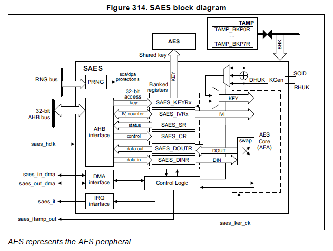
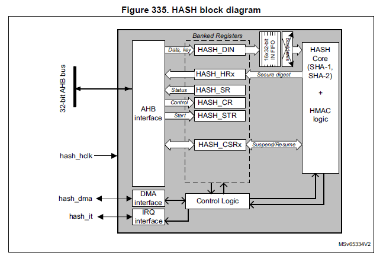
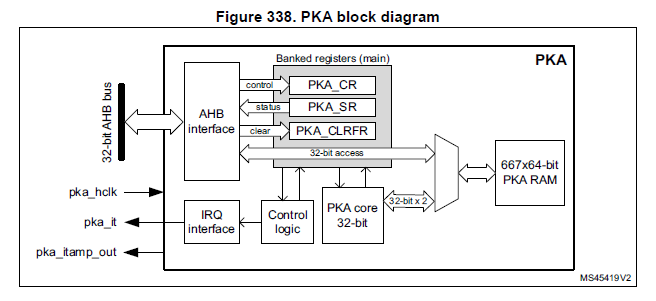

# Hardware Reference

Low-level hardware configuration notes for STM32 H5/H7 targets used by MPLIB.

---

## Security Architecture (STM32H5)

Reference: ST documentation RM0481.pdf

### Key Management


### AES Block Diagram


### SAES Block Diagram



### HASH Block Diagram



### PKA Block Diagram



### Cryptographic Library Middleware


---

## UID Memory Access

Reading the STM32 96-bit unique device ID via MPU configuration.

### MPU Region Setup

```c
MPU_Region_InitTypeDef MPU_InitStruct = {0};
MPU_Attributes_InitTypeDef MPU_AttributesInit = {0};

/* Disables the MPU */
HAL_MPU_Disable();

MPU_InitStruct.Enable = MPU_REGION_ENABLE;
MPU_InitStruct.Number = MPU_REGION_NUMBER0;
MPU_InitStruct.BaseAddress = 0x08FFF800;
MPU_InitStruct.LimitAddress = 0x08FFFFFF;
MPU_InitStruct.AttributesIndex = MPU_ATTRIBUTES_NUMBER0;
MPU_InitStruct.AccessPermission = MPU_REGION_ALL_RO;
MPU_InitStruct.DisableExec = MPU_INSTRUCTION_ACCESS_DISABLE;
MPU_InitStruct.IsShareable = MPU_ACCESS_NOT_SHAREABLE;

HAL_MPU_ConfigRegion(&MPU_InitStruct);

MPU_AttributesInit.Number = MPU_REGION_NUMBER0;
MPU_AttributesInit.Attributes = MPU_DEVICE_nGnRnE | MPU_NOT_CACHEABLE
                              | MPU_TRANSIENT | MPU_NO_ALLOCATE;

HAL_MPU_ConfigMemoryAttributes(&MPU_AttributesInit);

/* Enables the MPU */
HAL_MPU_Enable(MPU_PRIVILEGED_DEFAULT);
```

### Reading the UID

```c
#define UID_BASE  (0x08FFF800UL)  /* Unique device ID register base address */

uint32_t uid[3];
uid[0] = *(uint32_t *)UID_BASE;
uid[1] = *(uint32_t *)(UID_BASE + 4);
uid[2] = *(uint32_t *)(UID_BASE + 8);
```

Reference: [ST Community — How to obtain and use the STM32 96-bit UID](https://community.st.com/t5/stm32-mcus/how-to-obtain-and-use-the-stm32-96-bit-uid/ta-p/621443)

---

## USB BSP Power Voltage

USB power management using BSP USBPD functions.

### Power Control

```c
status = BSP_USBPD_PWR_VBUSOff(PortNum);
// and BSP_USBPD_PWR_VBUSOn(PortNum);
```

### Setup Requirements

1. Copy BSP STM32H573I-DK BUS and USBPD files to project
2. Copy BSP Components: TCPP0203 (and others from example project — CubeMX does not generate these)
3. Add symbol: `TCPP0203_SUPPORT`

### Interrupt Handler (stm32h5xx_it.c)

```c
#if defined(TCPP0203_SUPPORT)

void EXTI1_IRQHandler(void)
{
    if (LL_EXTI_IsActiveFallingFlag_0_31(LL_EXTI_LINE_1) != RESET)
    {
        BSP_USBPD_PWR_EventCallback(USBPD_PWR_TYPE_C_PORT_1);
        LL_EXTI_ClearFallingFlag_0_31(LL_EXTI_LINE_1);
    }
}

#endif /* TCPP0203_SUPPORT */
```

---

## Serial UART Tips

### Clear Terminal Screen

```c
printf("\x1B[2J");           // Clear screen
printf("%c[0;0H", 0x1b);    // Move cursor to top-left
```
