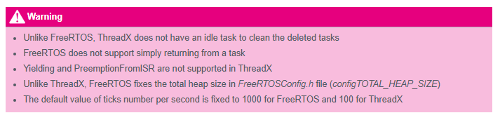

# FreeRTOS and ThreadX Comparison

API equivalence for migrating between FreeRTOS (CMSIS-RTOS V2) and Azure RTOS (Eclipse ThreadX) in MPLIB projects.

## RTOS Equivalence Table

| Asset                | FreeRTOS (CMSIS-RTOS V2) | Azure RTOS (Eclipse ThreadX) |
|----------------------|--------------------------|------------------------------|
| Thread config        | `osThreadAttr_t`         | N/A                          |
| Thread               | `osThreadId_t`           | `TX_THREAD`                  |
| Queue                | `osMessageQueueId_t`     | `TX_QUEUE`                   |
| Mutex                | `osMutexId_t`            | `TX_MUTEX`                   |
| Event / Flags config | `osMessageQueueAttr_t`   | *(TBC)*                      |
| Event / Flags        | `osEventFlagsId_t`       | *(TBC)*                      |
| Heap stats           | `vPortGetHeapStats`      | `TX_BYTE_POOL`               |
| Memory allocation    | `pvPortMalloc`           | `tx_byte_allocate`           |
| Memory free          | `vPortFree`              | `tx_byte_release`            |
| Memory pool          | N/A                      | `tx_byte_pool_create`        |
| Thread sleep         | `osThreadSuspend`        | `tx_thread_suspend`          |
| Thread resume        | `osThreadResume`         | `tx_thread_resume`           |
| Delay                | `HAL_Delay`              | `tx_thread_sleep` (/10)      |

## Conditional Compilation

MPLIB uses preprocessor symbols to target the active RTOS:

```c
#if defined(FREERTOS)
// FreeRTOS / CMSIS-RTOS V2 API
#elif defined(AZRTOS)
// Azure RTOS / Eclipse ThreadX API
#endif
```

See [IDE Configuration — Symbols](ide-config.md#symbols) for the full symbol list.

## External Reference

ST introduction to ThreadX: [wiki.st.com — Introduction to ThreadX](https://wiki.st.com/stm32mcu/wiki/Introduction_to_THREADX)



