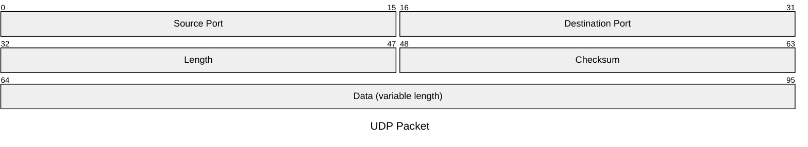

# COMMUNICATIONS

## Communication table documentation
    
|Communication|Type|Protocol|Port src/local|Port dst/remote|Description|
|--|--|--|--|--|--|
|Announce|Client|UDP|13131|31313|Send announcement broadcast UDP datagram including ECC public key for session initialization with other nodes on the network lan|
|Proceed|Server|UDP|31313|na|Receive announcement, coordinate ECC to initialize and PQC unicast announce to the node on the network UDP broadcasting|
|Announce (TO BE MODIFIED)|Client|TCP|13131|31313|Upon UDP broadcast received by Proceed service, send announcement TCP unicast including PQC public key and cypher for session initialization with other nodes on the network lan|
|Proceed (TO BE MODIFIED)|Server|TCP|31313|na|Receive TCP unicast announcement and coordinate PQC to initialize|
|ECC sender initializer|Client|UDP|13133|31333|ECC Session Initialization, ECC_Session_Send|
|ECC receiver|Server,Client|UDP|13333|33333|ECC Session Establishment, ECC_Session_Establish|
|ECC establisher|Serer|UDP|33333|na|ECC Session Establishment|
|PQC|Client|TCP|TBD|TBD|TBC|
|PQC|Serer|TCP|TBD|TBD|TBC|
|Data sender|Client|UDP|34331|34333|Send tokens data example: clear-text, cypher-ecc-aes and cypher-pqc-aes|
|Data receiver|Server|UDP|34333|na|Receive tokens data example: clear-text, cypher-ecc-aes and cypher-pqc-aes|

## Communication between nodes

|||
|--|--|
| ```mermaid<br/> graph TD;<br/> sequenceDiagram;<br/> participant N1 as Node on LAN;<br/> participant N2 as Node on LAN;<br/> N1->>N2: UDP Broadcast Announce;<br/> N2->>N1: ECC initialization;<br/> N1->>N2: ECC establishment;<br/> N1->>N2: Data communication;<br/> N2->>N1: Data communication response;<br/> ``` | ```mermaid<br/>  graph TD;<br/> sequenceDiagram;<br/> participant N1 as Node on LAN;<br/> participant N2 as Node on LAN;<br/> N1->>N2: UDP Broadcast Announce;<br/> N2->>N1: ECC initialization;<br/> N1->>N2: ECC establishment;<br/> N1->>N2: Data communication ;<br/> N2->>N1: Data communication response;<br/> ``` |
|description|description|

## UDP Payloads



|Payload type|Position|Description|
|--|--|--|
|Broadcast announcment|64-TBC|"ECC Public Key (N-TBC bytes)"|
|ECC initialization|64-TBC|"TBC (N bytes)"|
|ECC establishment|64-TBC|"TBC (N bytes)"|
|Data communication (and response)|64-65|"Cypher tag (1 byte)"|
|Data communication (and response)|65-TBC|"Data clear-text (N bytes)"|
|Data communication (and response)|65-TBC|"Data ecc-aes encrypted (N bytes)"|
|Data communication (and response)|65-TBC|"Data pqc-aes-encrypted (N bytes)"|

## TCP Payloads

(DEV, TBC)

