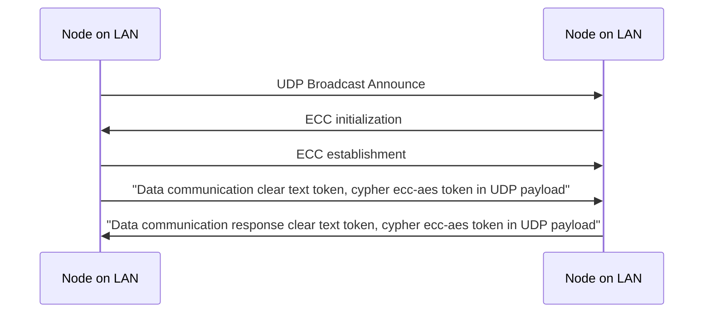
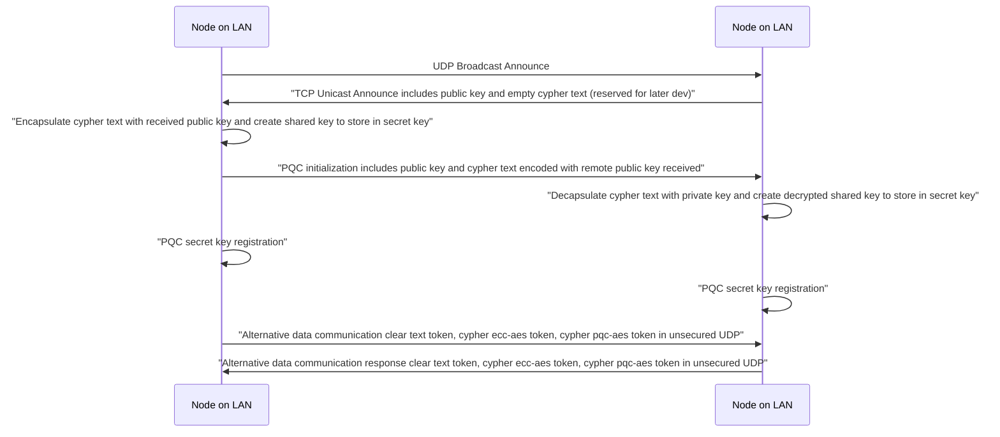
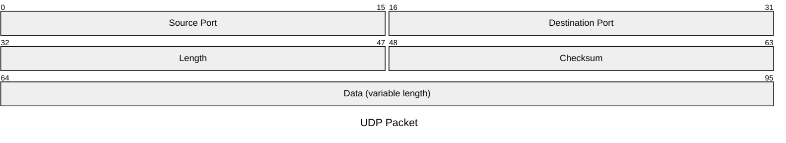
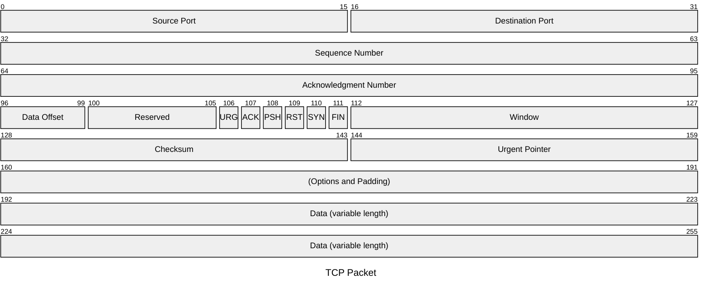

# COMMUNICATIONS

## Communication table documentation
    
|Communication|Type|Protocol|Port src/local|Port dst/remote|Description|
|--|--|--|--|--|--|
|Announce ECC|Client|UDP|13131|31313|Send announcement broadcast UDP datagram including ECC public key for session initialization with other nodes on the network lan|
|Proceed ECC|Server|UDP|31313|na|Receive announcement, coordinate ECC to initialize and engage PQC unicast announce to the node on the network UDP broadcasting|
|ECC sender initializer|Client|UDP|13133|31333|ECC Session Initialization, ECC_Session_Send|
|ECC receiver|Server,Client|UDP|13333|33333|ECC Session Establishment, ECC_Session_Establish|
|ECC establisher|Server|UDP|33333|na|ECC Session Establishment|
|Announce PQC|Client|TCP|13131|31313|Upon UDP broadcast received by Proceed service, send announcement TCP unicast including PQC public key and cypher for session initialization with other nodes on the network lan|
|Proceed PQC|Server|TCP|31313|na|Receive TCP unicast announcement and coordinate PQC to initialize|
|Data sender|Client|UDP|34331|34333|Send tokens data example: clear-text, cypher-ecc-aes and cypher-pqc-aes|
|Data receiver|Server|UDP|34333|na|Receive tokens data example: clear-text, cypher-ecc-aes and cypher-pqc-aes|

## Communication between nodes

### ECC KEM

The lab prototype have been designed initially to support ECC KEM. Next diagram shows the key exchange not transported and created on both sides.

### PQC ML-KEM

In the migration transition, the ECC key exchange mechanism is still active. Next diagram only shows the PQC key exchange mechanism been involved upon UDP broadcast from a node on the network.

## PQC Sizes to consider

The migration would requires to fragment UDP communications to support the new sizes of the PQC keys. The key exchange mechanism will be accomplished with the TCP protocol. For more details of the new sizes of the PQC keys see [PQC Sizes table](pqc-sizes.md)

*See [PQC Sizes table](pqc-sizes.md) for ML-KEM and ML-DSA key size reference.*

## UDP Payloads

    
|Payload type|Position|Description|
|--|--|--|
|Broadcast UDP announcment|64-TBC|"PQC Public Key (N-TBC bytes)"|
|ECC initialization|64-TBC|"TBC (N bytes)"|
|ECC establishment|64-TBC|"TBC (N bytes)"|
|Data communication (and response)|64-65|"Cypher tag (1 byte)"|
|Data communication (and response)|65-TBC|"Data clear-text (N bytes)"|
|Data communication (and response)|65-TBC|"Data ecc-aes encrypted (N bytes)"|
|Data communication (and response)|65-TBC|"Data pqc-aes encrypted (N bytes)" once PQC established|

## TCP Payloads

    
|Payload type|Position|Description|
|--|--|--|
|Unicast TCP announcment|192-TBC|"ECC Public Key (N-TBC bytes)"|
|PQC initialization|192-TBC|"TBC (N bytes)"|
|PQC establishment|192-TBC|"TBC (N bytes)"|
|Data communication (and response)|192-193|"Cypher tag (1 byte)"|
|Data communication (and response)|193-TBC|"Data clear-text (N bytes)"|
|Data communication (and response)|193-TBC|"Data ecc-aes encrypted (N bytes)" if ECC established|
|Data communication (and response)|193-TBC|"Data pqc-aes-encrypted (N bytes)"|

