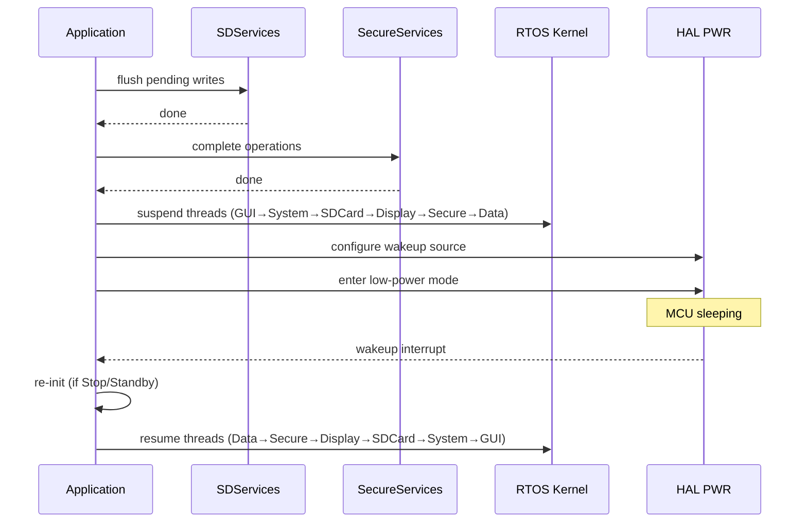
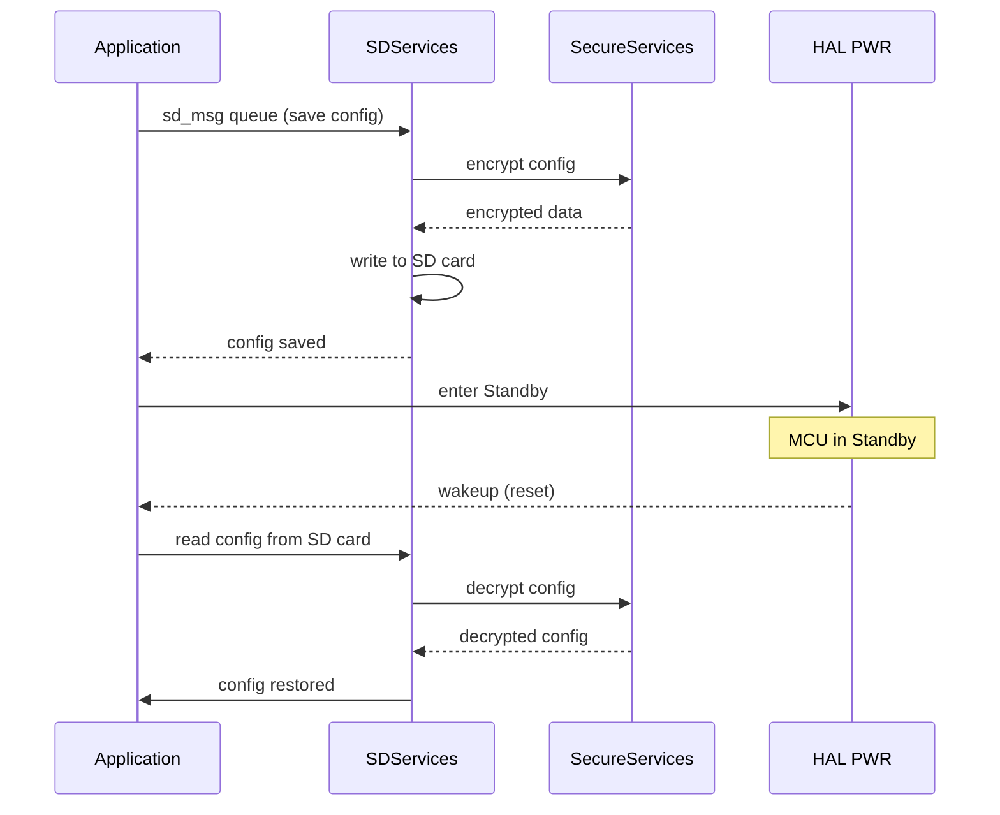

# WAKEUP FUNCTIONALITY

MCU low-power wakeup and RTOS thread wakeup patterns for MPLIB on STM32 H5, H7, and N6.

## STM32 LOW-POWER MODES

### Mode Summary

| Mode    | CPU | SRAM | Peripherals | Wakeup latency | Use case |
| ------- | --- | ---- | ----------- | -------------- | -------- |
| Sleep   | Off | Retained | Running | Fastest | Short idle between tasks |
| Stop    | Off | Retained | Off (except wakeup logic) | Medium | Waiting for external event |
| Standby | Off | Lost (except backup SRAM) | Off | Slowest (full re-init) | Long idle, battery powered |

### Mode Details

#### Sleep Mode

- CPU clock stopped, all peripherals and SRAM remain active
- Entered with `HAL_PWR_EnterSLEEPMode(PWR_MAINREGULATOR_ON, PWR_SLEEPENTRY_WFI)`
- Wakeup by any interrupt or event
- No re-initialization needed after wakeup

#### Stop Mode

- All clocks stopped except LSI/LSE
- SRAM and register contents retained
- Entered with `HAL_PWR_EnterSTOPMode(PWR_LOWPOWERREGULATOR_ON, PWR_STOPENTRY_WFI)`
- Requires clock re-configuration after wakeup (SystemClock_Config)

#### Standby Mode

- Lowest power consumption
- SRAM contents lost, backup SRAM retained if VBAT supplied
- Entered with `HAL_PWR_EnterSTANDBYMode()`
- Wakeup triggers full system reset (re-init from main)
- Backup registers (32x 32-bit) survive for state persistence

## WAKEUP SOURCES

### Per MCU Family

| Wakeup source | H5 | H7 | N6 |
| ------------- | -- | -- | -- |
| EXTI (GPIO) | x | x | x |
| RTC alarm | x | x | x |
| RTC wakeup timer | x | x | x |
| UART (receive) | x | x | x |
| LPUART | x | - | x |
| Wakeup pin (WKUP) | x | x | x |
| IWDG | x | x | x |
| Ethernet WoL | x | x | x |
| USB | x | x | x |

### Wakeup Pin Configuration

```c
// Enable wakeup pin (rising edge)
HAL_PWR_EnableWakeUpPin(PWR_WAKEUP_PIN1_HIGH);

// Clear wakeup flag before entering low-power mode
__HAL_PWR_CLEAR_FLAG(PWR_FLAG_WU);
```

### RTC Wakeup Timer

```c
// Configure RTC wakeup timer (example: 5 second wakeup)
HAL_RTCEx_SetWakeUpTimer_IT(&hrtc, 0x1400, RTC_WAKEUPCLOCK_RTCCLK_DIV16);
```

### EXTI Wakeup (GPIO)

```c
// Configure GPIO as EXTI wakeup source (user button example)
GPIO_InitTypeDef GPIO_InitStruct = {0};
GPIO_InitStruct.Pin = GPIO_PIN_13;
GPIO_InitStruct.Mode = GPIO_MODE_IT_FALLING;
GPIO_InitStruct.Pull = GPIO_NOPULL;
HAL_GPIO_Init(GPIOC, &GPIO_InitStruct);

HAL_NVIC_SetPriority(EXTI13_IRQn, 0, 0);
HAL_NVIC_EnableIRQ(EXTI13_IRQn);
```

## ENTERING LOW-POWER MODE

### Pre-Sleep Checklist

Before entering any low-power mode, MPLIB threads must be in a safe state:

1. Flush pending SD card writes (SDServices)
2. Complete any in-progress encryption operations (SecureServices)
3. Suspend RTOS threads in reverse resume order
4. Disable peripherals not needed for wakeup
5. Configure wakeup source
6. Enter low-power mode

### Thread Suspend Ordering (before sleep)

Reverse of the documented resume order:

```
GUI → System → SDCard → Display → Secure → Data
```

### Entry Sequence



## WAKEUP RE-INITIALIZATION

### After Sleep Mode

No re-initialization needed. Execution resumes from the instruction following WFI.

### After Stop Mode

Clock tree is reset. Peripherals retain configuration but clocks must be restored:

```c
void WakeupFromStop(void)
{
    // Restore system clock configuration
    SystemClock_Config();

    // Re-enable peripheral clocks as needed
    // HAL drivers retain their state, no re-init required
}
```

### After Standby Mode

Full re-initialization from reset. Use backup registers to detect wakeup vs cold boot:

```c
// In main(), detect wakeup from standby
if (__HAL_PWR_GET_FLAG(PWR_FLAG_SB) != RESET)
{
    // Wakeup from standby
    __HAL_PWR_CLEAR_FLAG(PWR_FLAG_SB);

    // Read state from backup registers
    uint32_t saved_state = HAL_RTCEx_BKUPRead(&hrtc, RTC_BKP_DR0);

    // Restore application state from backup SRAM / SD card
    // ...
}
else
{
    // Normal cold boot
    // ...
}
```

### Conditional Compilation

```c
#if defined(STM32H573xx)
    // H5: supports LSECSS wakeup, LPUART wakeup
    HAL_PWREx_EnableUltraLowPowerMode();
#elif defined(STM32H743xx)
    // H7: D1/D2/D3 domain power control
    HAL_PWREx_EnterSTOPMode(PWR_MAINREGULATOR_ON, PWR_STOPENTRY_WFI, PWR_D1_DOMAIN);
#endif
```

## RTOS THREAD WAKEUP PATTERNS

### Thread Resume After MCU Wakeup

Resume threads in the documented MPLIB order:

```
Data → Secure → Display → SDCard → System → GUI
```

#### Azure RTOS (ThreadX)

```c
void ResumeAllThreads(void)
{
    tx_thread_resume(&DataServicesHandle);
    tx_thread_resume(&SecureServiceHandle);
    tx_thread_sleep(30);
    tx_thread_resume(&DisplayServiceHandle);
    tx_thread_sleep(30);
    tx_thread_resume(&SDServiceHandle);
    tx_thread_resume(&SystemServiceTaHandle);
    tx_thread_resume(&GUI_TaskHandle);
}

void SuspendAllThreads(void)
{
    tx_thread_suspend(&GUI_TaskHandle);
    tx_thread_suspend(&SystemServiceTaHandle);
    tx_thread_suspend(&SDServiceHandle);
    tx_thread_suspend(&DisplayServiceHandle);
    tx_thread_suspend(&SecureServiceHandle);
    tx_thread_suspend(&DataServicesHandle);
}
```

#### FreeRTOS

```c
void ResumeAllThreads(void)
{
    osThreadResume(DataServicesHandle);
    osThreadResume(SecureServiceHandle);
    osDelay(30);
    osThreadResume(DisplayServiceHandle);
    osDelay(30);
    osThreadResume(SDServiceHandle);
    osThreadResume(SystemServiceTaskHandle);
    osThreadResume(GUI_TaskHandle);
}

void SuspendAllThreads(void)
{
    osThreadSuspend(GUI_TaskHandle);
    osThreadSuspend(SystemServiceTaskHandle);
    osThreadSuspend(SDServiceHandle);
    osThreadSuspend(DisplayServiceHandle);
    osThreadSuspend(SecureServiceHandle);
    osThreadSuspend(DataServicesHandle);
}
```

### RTOS Equivalence for Wakeup

| Operation | FreeRTOS | AZRTOS (ThreadX) |
| --------- | -------- | ----------------- |
| Suspend thread | osThreadSuspend | tx_thread_suspend |
| Resume thread | osThreadResume | tx_thread_resume |
| Delay (yield) | osDelay | tx_thread_sleep |
| Event flag wait (sleep until event) | osEventFlagsWait | tx_event_flags_get |
| Event flag set (wakeup signal) | osEventFlagsSet | tx_event_flags_set |

### Event-Driven Thread Wakeup

Instead of polling, threads can sleep on event flags and be woken by a wakeup event:

#### Azure RTOS

```c
// Thread waiting for wakeup event
ULONG actual_flags;
tx_event_flags_get(&wakeup_event_group, WAKEUP_FLAG, TX_OR_CLEAR,
                   &actual_flags, TX_WAIT_FOREVER);
// Thread resumes here after wakeup flag is set
```

```c
// Trigger wakeup from ISR or another thread
tx_event_flags_set(&wakeup_event_group, WAKEUP_FLAG, TX_OR);
```

#### FreeRTOS

```c
// Thread waiting for wakeup event
osEventFlagsWait(wakeupEventHandle, WAKEUP_FLAG, osFlagsWaitAny, osWaitForever);
// Thread resumes here after wakeup flag is set
```

```c
// Trigger wakeup from ISR
osEventFlagsSet(wakeupEventHandle, WAKEUP_FLAG);
```

## STATE PERSISTENCE ACROSS WAKEUP

### Backup Registers (Standby-safe)

Use RTC backup registers for small state data that must survive Standby mode:

```c
// Save state before entering Standby
HAL_RTCEx_BKUPWrite(&hrtc, RTC_BKP_DR0, app_state);
HAL_RTCEx_BKUPWrite(&hrtc, RTC_BKP_DR1, connection_flags);

// Restore after wakeup
uint32_t app_state = HAL_RTCEx_BKUPRead(&hrtc, RTC_BKP_DR0);
uint32_t connection_flags = HAL_RTCEx_BKUPRead(&hrtc, RTC_BKP_DR1);
```

### SD Card Persistence (via SDServices)

For larger state, save config to SD card before entering low-power mode, then reload via the existing SDServices config read path after wakeup:


